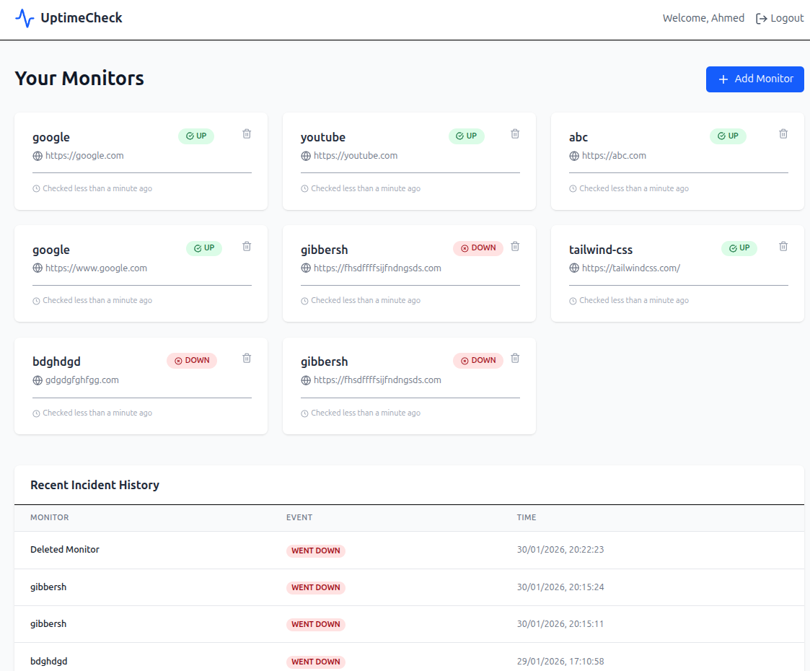

# Uptime Monitor 🚀

A full-stack, real-time website monitoring tool built with the MERN stack. This application allows users to track the status, response times, and availability of multiple URLs simultaneously with live updates and automated background polling.

  

🌟 Features
Real-Time Dashboard: View live status updates (Up/Down) and latency metrics without refreshing the page.

Automated Monitoring: Background workers check your URLs at specific intervals using node-cron.

Interactive Visualization: Track response time trends and historical uptime data.

Secure Authentication: User-specific dashboards protected by JWT and Bcrypt encryption.

Instant Notifications: Immediate UI alerts triggered via WebSockets when a site goes down.

🛠 Tech Stack
Frontend: React.js, Tailwind CSS, Axios

Backend: Node.js, Express.js

Database: MongoDB (Mongoose)

Real-time: Socket.io

Scheduling: Node-Cron

🏗 Architecture
The project follows a decoupled architecture:

Polling Engine: A backend service that periodically sends HTTP requests to monitored URLs.

WebSocket Layer: Bridges the backend and frontend to push updates instantly.

REST API: Handles CRUD operations for monitors and user authentication.

🚀 Getting Started
Prerequisites
Node.js (v16+)

MongoDB Atlas account or local MongoDB instance

Installation
Clone the repository

Bash

git clone https://github.com/your-username/uptime-monitor.git
cd uptime-monitor
Setup Backend

Bash

cd backend
npm install
Create a .env file in the backend folder:

Code snippet

PORT=5000
MONGO_URI=your_mongodb_uri
JWT_SECRET=your_secret_key
Setup Frontend

Bash

cd ../frontend
npm install
Run the Application

Run Backend: npm start (inside /backend)

Run Frontend: npm start (inside /frontend)
