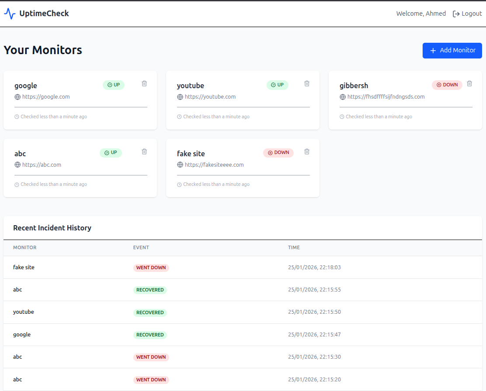

# 🚀 Uptime Monitor

A full-stack, real-time website monitoring tool built with the MERN stack. This application allows users to track the status, response times, and availability of multiple URLs simultaneously with live updates, automated background polling, and email notifications.


<p align="center">
  
</p>

## ✨ Key Features

* **📊 Real-Time Dashboard:** View live status updates (Up/Down) and latency metrics without refreshing the page.
* **🤖 Automated Monitoring:** Background workers check your URLs at specific intervals using node-cron.
* **📈 Interactive Visualization:** Track response time trends and historical uptime data.
* **🔐 Secure Authentication:** User-specific dashboards protected by JWT and Bcrypt encryption.
* **🔔 Instant Notifications:** Immediate UI alerts triggered via WebSockets when a site goes down.
* **📧 Email Alerts:** Automatic email notifications sent to users when monitored sites experience downtime.

---

## 🛠️ Tech Stack

* **Frontend:** React.js, Tailwind CSS, Axios
* **Backend:** Node.js, Express.js
* **Database:** MongoDB (Mongoose)
* **Real-time:** Socket.io
* **Scheduling:** Node-Cron
* **Authentication:** JWT, Bcrypt
* **Email Service:** Nodemailer

---

## 🏗️ Architecture

The project follows a decoupled architecture:

* **Polling Engine:** A backend service that periodically sends HTTP requests to monitored URLs.
* **WebSocket Layer:** Bridges the backend and frontend to push updates instantly.
* **Email Service:** Sends automated email alerts when downtime is detected.
* **REST API:** Handles CRUD operations for monitors and user authentication.

---

## 🚀 Getting Started

### Prerequisites

* Node.js (v16+)
* MongoDB Atlas account or local MongoDB instance
* Email service credentials (Gmail, SendGrid, etc.)

### Installation

**1. Clone the repository**

```bash
git clone https://github.com/aqeell7/uptime-monitor.git
cd uptime-monitor
```

**2. Setup Backend**

```bash
cd backend
npm install
```

Create a `.env` file in the backend folder:

```env
PORT=5000
MONGO_URI=your_mongodb_uri
JWT_SECRET=your_secret_key
EMAIL_USER=your_email@gmail.com
EMAIL_PASS=your_email_password
```

**3. Setup Frontend**

```bash
cd ../frontend
npm install
```

### Run the Application

**Start Backend:**

```bash
cd backend
npm start
```

**Start Frontend:**

```bash
cd frontend
npm start
```

The application will be available at:
* **Frontend:** http://localhost:3000
* **Backend:** http://localhost:5000

---

## 📂 Project Structure

```bash
uptime-monitor/
├── backend/
│   ├── config/         # Database configuration
│   ├── controllers/    # Request handlers
│   ├── middlewares/    # Auth & validation
│   ├── models/         # Mongoose schemas
│   ├── routes/         # API endpoints
│   ├── services/       # Business logic & polling
│   ├── utils/          # Email service & helpers
│   └── server.js       # Entry point
├── frontend/
│   ├── src/
│   │   ├── components/ # React components
│   │   ├── pages/      # Page views
│   │   ├── services/   # API calls
│   │   └── App.js      # Main app component
│   └── public/
└── README.md
```

---

## 📝 API Endpoints

| Method | Endpoint | Description | Auth Required |
|--------|----------|-------------|---------------|
| POST | `/api/auth/signup` | Register a new user | ❌ |
| POST | `/api/auth/login` | Login and get JWT | ❌ |
| GET | `/api/monitors` | Get all monitors | ✅ |
| POST | `/api/monitors` | Create a new monitor | ✅ |
| PUT | `/api/monitors/:id` | Update monitor settings | ✅ |
| DELETE | `/api/monitors/:id` | Delete a monitor | ✅ |
| GET | `/api/monitors/:id/stats` | Get monitor statistics | ✅ |

---

## 🎯 Key Features Breakdown

### Real-Time Updates
* WebSocket connection established on page load
* Instant status changes pushed to all connected clients
* No polling required on the frontend

### Automated Polling
* Configurable check intervals (1min, 5min, 15min, etc.)
* Concurrent monitoring of multiple URLs
* Graceful failure handling and retry logic

### Email Notifications
* Automatic email alerts sent when a site goes down
* Customizable email templates
* Notification sent to the user's registered email address
* Prevents spam with intelligent alert throttling

### Dashboard Metrics
* Current status (Up/Down)
* Response time (latency in ms)
* Uptime percentage (24h, 7d, 30d)
* Historical data visualization

---

## 📄 License

This project is licensed under the MIT License - see the [LICENSE](LICENSE) file for details.